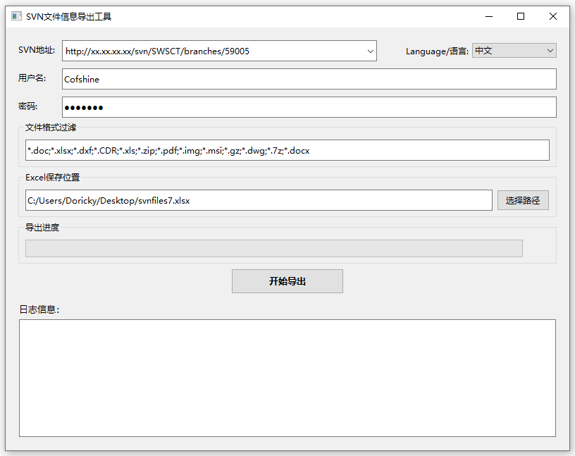

# SVN文件信息导出工具

这是一个用于从SVN仓库中提取文件信息并生成Excel文档的工具。

## 功能特点
- 支持SVN仓库文件信息提取（包括文件名、路径、版本号、作者、提交时间等）
- 提供图形用户界面，操作简单直观
- 支持文件格式过滤（可选择性导出特定类型的文件）
- 支持子目录递归扫描
- 自动保存历史记录（SVN地址、用户名等）
- 显示实时执行进度和日志信息
- 支持回车键快速执行
- 支持多语言（英文/中文）

## 环境要求
- Windows 操作系统
- [TortoiseSVN](https://tortoisesvn.net/downloads.html)（必须安装命令行工具）
  - 安装时请勾选"command line client tools"选项
  - 安装后需要将SVN命令行工具添加到系统PATH中

## 使用方法
1. 运行程序（双击exe文件）
2. 输入以下信息：
   - SVN仓库地址
   - 用户名和密码
   - 文件格式过滤（可选，例如：*.dwg;*.dxf;*.xlsx）
   - Excel保存位置
3. 点击"开始导出"或按回车键执行
4. 等待程序完成并查看结果

## 开发环境
- Python 3.8+
- PySide6（Qt for Python）
- openpyxl（Excel处理）

## 编译说明
1. 安装依赖：
```bash
pip install -r requirements.txt
```

2. 执行打包：
```bash
pyinstaller build.spec
```

## 注意事项
1. 首次使用前请确保已正确安装TortoiseSVN及其命令行工具
2. 如遇到"未检测到SVN命令行工具"错误，请检查：
   - TortoiseSVN是否已安装
   - 安装时是否勾选了命令行工具
   - 系统环境变量PATH中是否包含SVN命令行工具路径
3. 文件格式过滤支持通配符（*）匹配
4. 所有输入框（除密码外）会自动保存上次使用的值
5. SVN地址支持历史记录，可保存最近使用的10个地址

## 使用示例

